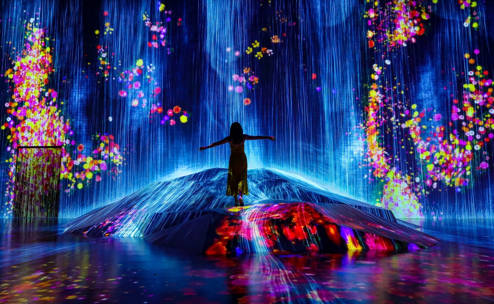
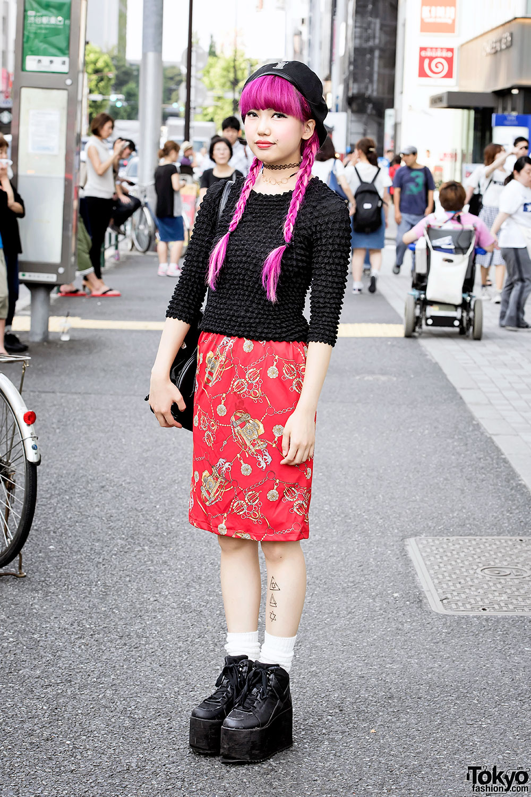

# **THE TOKYO EXPERIENCE**

## Explore the Metropolis

What are you interested in?

 [*architecture*](#architecture) - [*art*](#ART) - [*fashion*](#fashion) - [*culture*](#culture) - [*experience*](#experienc)

## ARCHITECTURE

### Top 10 Buildings to visit:

1. Tokyo Sky Tree
2. Tokyo Tower
3. Toranomon Hills

## ART

The **Digital Art Museum** is the largest museum in the world for interactive art, the exhibits tell stories and are very impressive and engaging

- 
- 
- 

Visit [Beyond The Art](https://www.beyondtheart.com) to get involved with the Art of the Metropolis for FREE

## FASHION

Reviews on the best shops in Japan:

*Archive Store, Shibuya*
> 'Beautiful underground store for fans of famous Japanese designers like Raf Simons' - 

## CULTURE

[Click here to learn all about Japanese Culture](https://www.bing.com/videos/search?q=japanese+culture&&view=detail&mid=B8CC51EA695B80E85782B8CC51EA695B80E85782&&FORM=VRDGAR)

## EXPERIENCE

To conclude, The culture is very different to ours , so you can experience a way of life that is new and inspiring

## VirtualGuide App

### If you are worried about being 