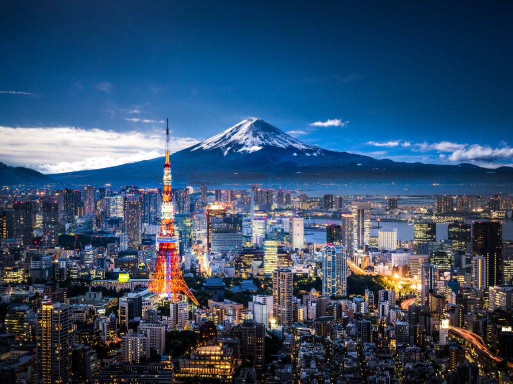
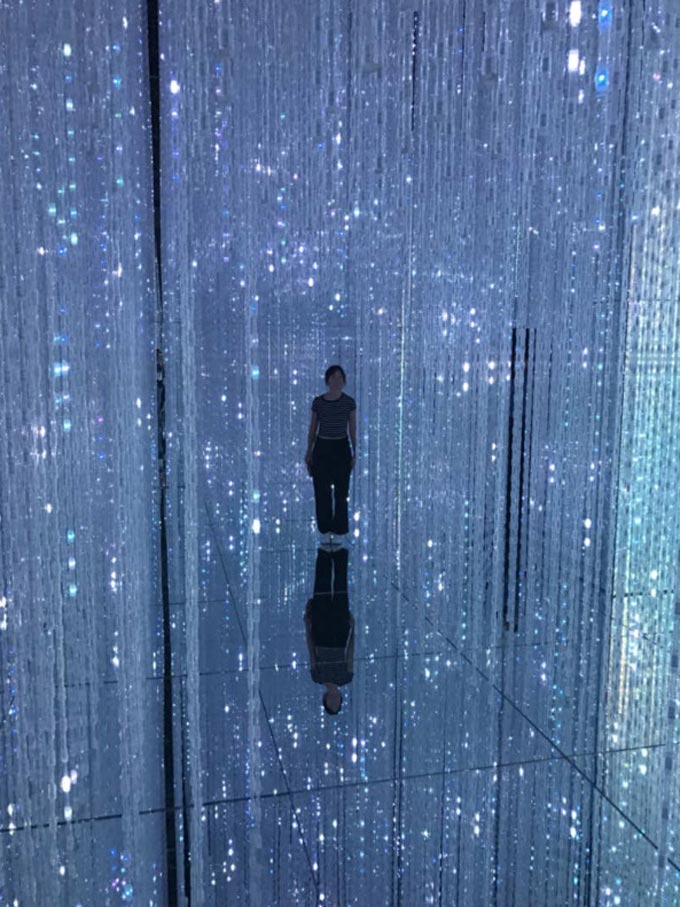
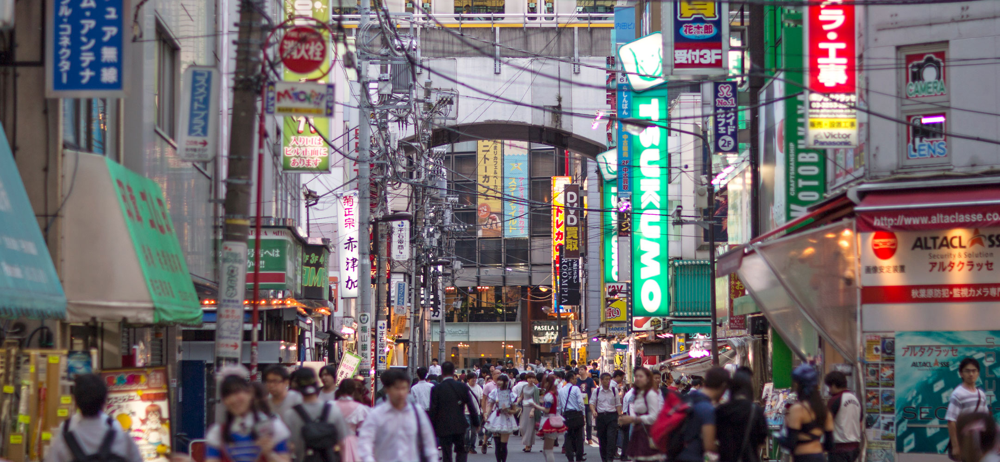

# **THE TOKYO EXPERIENCE**

## Explore the Metropolis

What are you interested in?

 [*architecture*](#architecture) - [*art*](#ART) - [*fashion*](#fashion) - [*culture*](#culture) - [*experience*](#experienc)

## ARCHITECTURE

### Top 10 Buildings to visit:

1. Tokyo Sky Tree
2. Tokyo Tower
3. Toranomon Hills

## ART

The **Digital Art Museum** is the largest museum in the world for interactive art, the exhibits tell stories and are very impressive and engaging

- 
- 
- 

Visit [Beyond The Art](https://www.beyondtheart.com) to get involved with the Art of the Metropolis for FREE

## FASHION

*Archive Store, Shibuya*
> 'Beautiful underground store for fans of famous Japanese designers like Raf Simons. Tokyo is full of amazing clothing stores thriving with passion'

## CULTURE

[Click here to learn all about Japanese Culture](https://www.bing.com/videos/search?q=japanese+culture&&view=detail&mid=B8CC51EA695B80E85782B8CC51EA695B80E85782&&FORM=VRDGAR)

## EXPERIENCE

To conclude, The culture is very different to ours , so you can experience a way of life that is new and inspiring. If you are worried about managing being in a culture foreign to you and you can't afford a tour guide be sure to check out the VirtualGuide app

### VirtualGuide App

This app uses Artificial Intelligence to create a virtual tour guide who will answer any questions you have involving your trip to Tokyo. It will use your location to give you information about the things around you and things that you can do. It includes an in-built translator so that the language barrier will not be a problem for you.